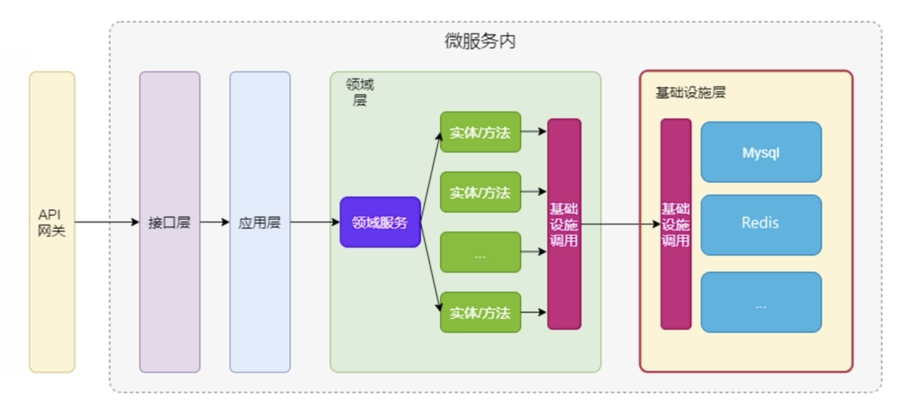
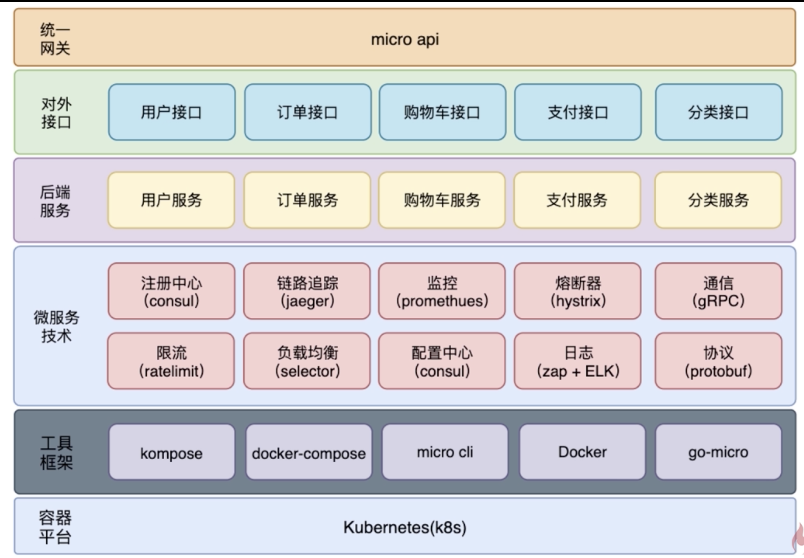
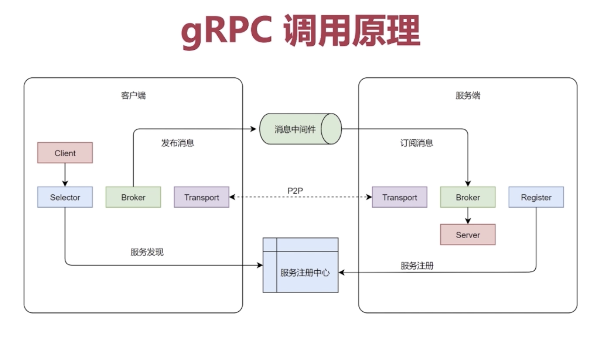
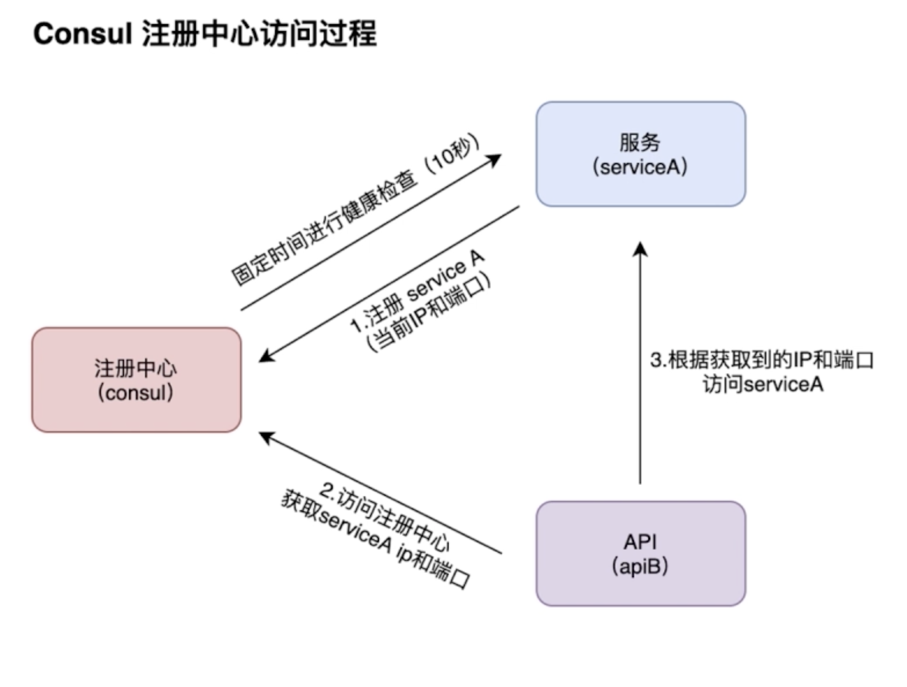
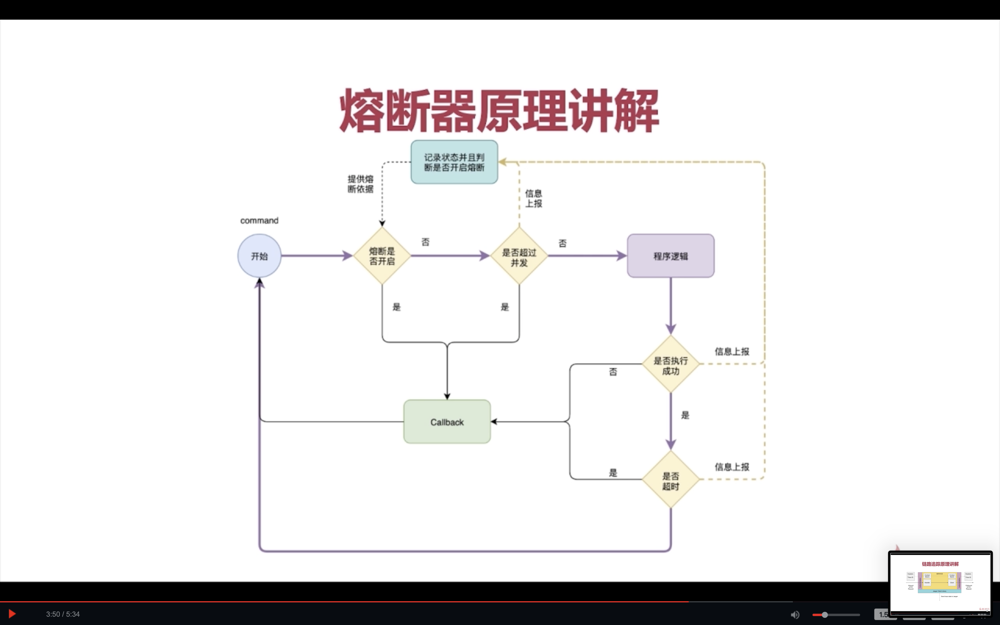
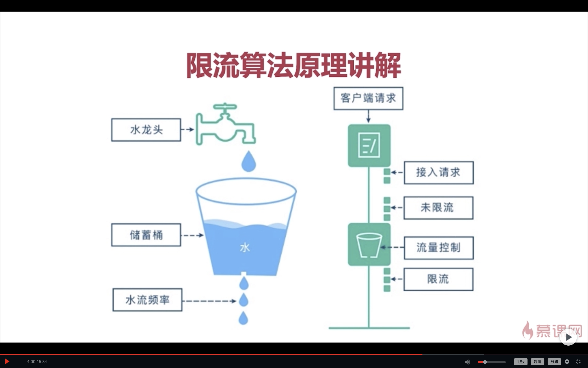
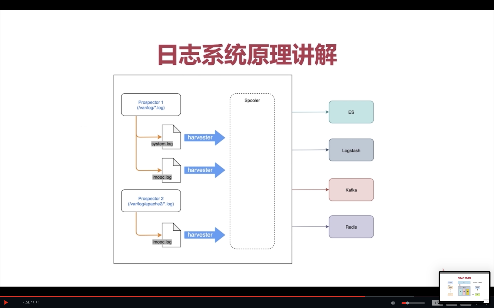
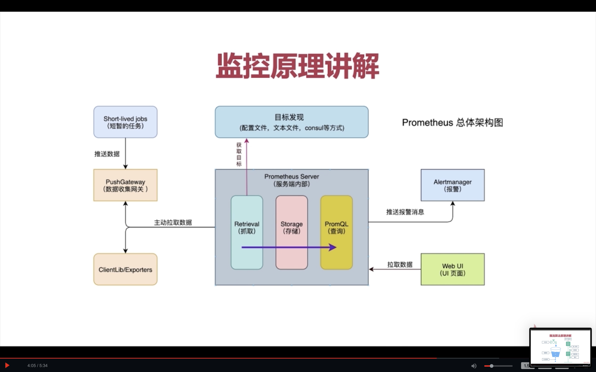

# 微服务

## 代码与实现
- [jwt实现鉴权](../../src/jwt/README.md)

## 一般微服务痛点

1. Json-rpc, protobuf, grpc, 自定义中间件;
2. Peewee, gin; yapi接口管理;
3. 日志管理, 优雅退出,jwt验证,表单, 短信与图片验证码;
4. 服务注册-consul, 服务发现-consul, 负载均衡-robin, 配置中心-nacos;
5. 项目实战: 商品|图片|库存|订单|购物车|支付;
6. 分布式事务-rocketmq, 分布式锁-redis+幂等性机制;
7. 链路追踪-jaeger, 熔断, 限流-sentinel
8. jwt鉴权,konga实现kong部署, url动态路由;
9. jenkins自动化部署

## go微服务相关图片

1. 相关架构
   

2. 细节与使用的工具
   

3. gRPC
   

4. 注册中心访问过程
   

5. 熔断器
   

6. 限流算法
   

7. 日志系统
   

8. 链路追踪
   

9. 监控
   
